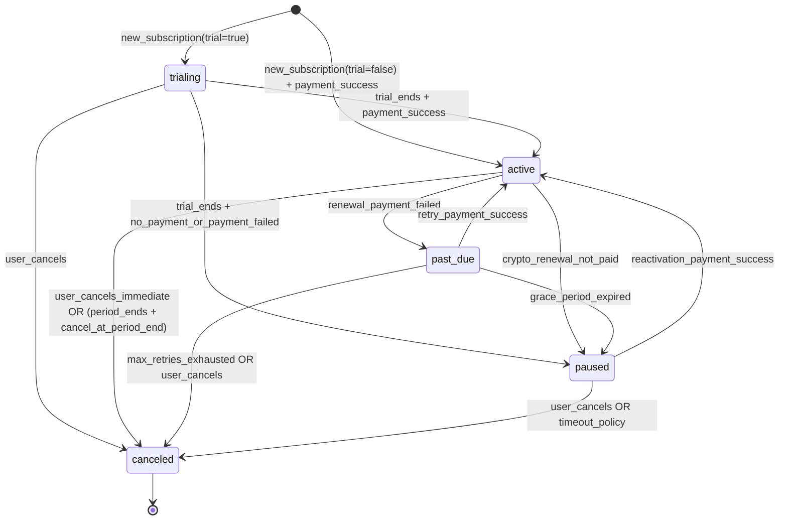
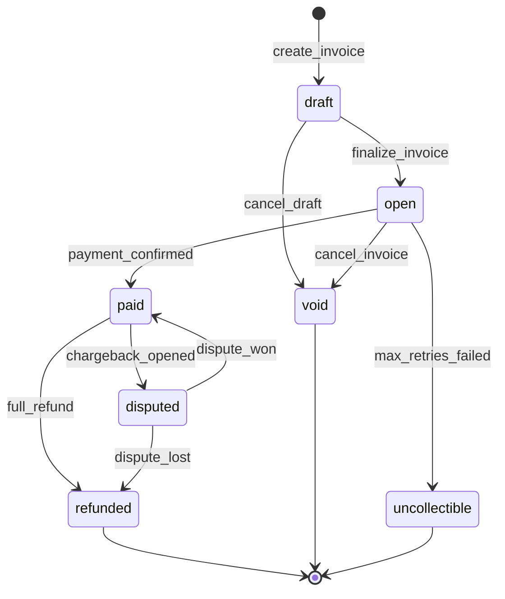
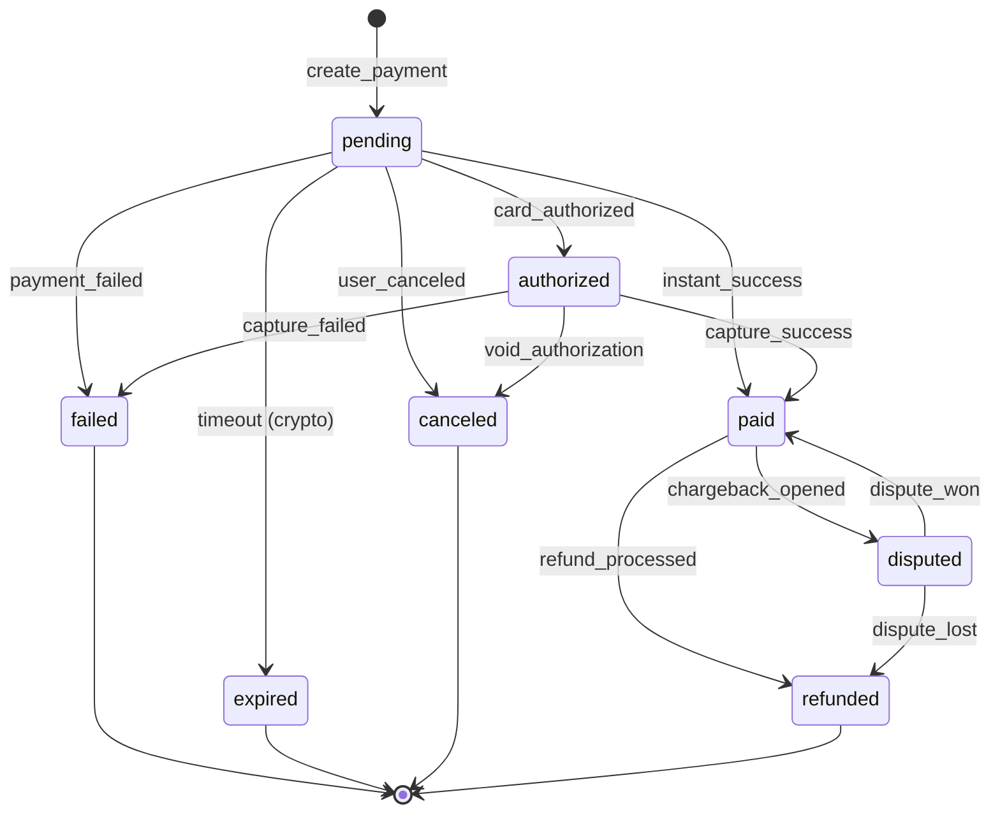
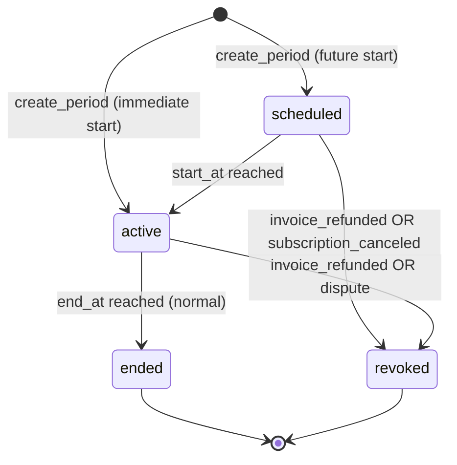
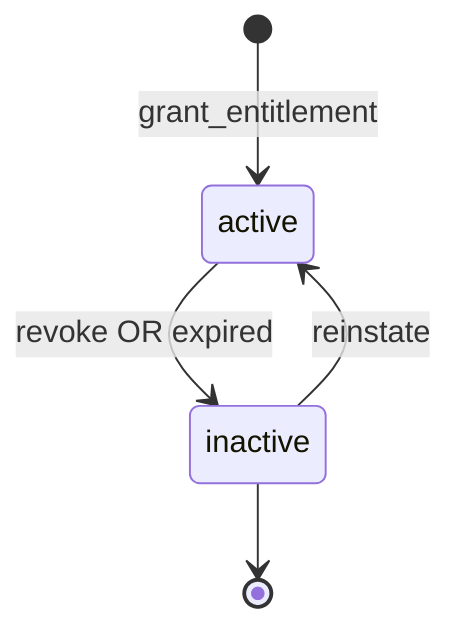

# reauth.dev Billing System - State Machines

All valid state transitions for stateful entities. Implement transition validators that reject invalid transitions.

---

## Subscription Status

### Subscription Transition Rules

| From | To | Trigger | Conditions |
|------|-----|---------|------------|
| `[init]` | `trialing` | `create_subscription` | `plan.trial_days > 0` |
| `[init]` | `active` | `create_subscription` | `plan.trial_days = 0` AND payment succeeded |
| `trialing` | `active` | `trial_conversion` | Payment succeeded |
| `trialing` | `paused` | `trial_expired` | No payment or payment failed (D01: no grace for trials) |
| `trialing` | `canceled` | `user_cancel` | User initiated |
| `active` | `past_due` | `renewal_failed` | `auto_renew = true` AND payment failed |
| `active` | `paused` | `renewal_expired` | `auto_renew = false` AND invoice not paid by due date |
| `active` | `canceled` | `user_cancel_immediate` | User initiated, immediate effect |
| `active` | `canceled` | `period_ended` | `cancel_at_period_end = true` AND period ended |
| `past_due` | `active` | `payment_recovered` | Retry payment succeeded |
| `past_due` | `paused` | `grace_expired` | `grace_end_at` reached without payment |
| `past_due` | `canceled` | `dunning_exhausted` | Max retries reached (configurable) |
| `past_due` | `canceled` | `user_cancel` | User initiated |
| `paused` | `active` | `reactivation` | New payment succeeded |
| `paused` | `canceled` | `user_cancel` | User initiated |
| `paused` | `canceled` | `timeout` | Configurable timeout policy |

### Invalid Transitions (must reject)

- `canceled` -> any state (terminal)
- `active` -> `trialing` (can't go back to trial)
- `paused` -> `past_due` (past_due is for active card retries)
- `paused` -> `trialing` (can't restart trial)

---

## Invoice Status

### Invoice Transition Rules

| From | To | Trigger | Side Effects |
|------|-----|---------|--------------|
| `[init]` | `draft` | `create_invoice` | None |
| `draft` | `open` | `finalize` | Can now collect payment |
| `draft` | `void` | `cancel` | No payment will be collected |
| `open` | `paid` | `payment.status = paid` | Grant entitlements, credits |
| `open` | `void` | `cancel` | No payment, no grants |
| `open` | `uncollectible` | `max_retries` | Mark as bad debt |
| `paid` | `refunded` | `refund_processed` | Reverse entitlements, credits |
| `paid` | `disputed` | `chargeback_opened` | Revoke entitlements, reverse credits |
| `disputed` | `paid` | `dispute_won` | Restore credits (not time) |
| `disputed` | `refunded` | `dispute_lost` | Already revoked, no further action |

### Invoice Status Meanings

| Status | Meaning |
|--------|---------|
| `draft` | Invoice created but not yet finalized (can still edit) |
| `open` | Awaiting payment |
| `paid` | Payment confirmed, entitlements/credits granted |
| `void` | Canceled, no payment expected or received |
| `uncollectible` | Failed to collect after all retries |
| `refunded` | Payment was refunded (full or partial, check `refund_amount`) |
| `disputed` | Chargeback/dispute opened, awaiting resolution |

---

## Payment Status

### Payment Transition Rules

| From | To | Trigger | Notes |
|------|-----|---------|-------|
| `[init]` | `pending` | `create_payment` | Charge initiated |
| `pending` | `authorized` | `webhook: authorized` | Card auth hold (if using separate auth/capture) |
| `pending` | `paid` | `webhook: succeeded` | Most common path |
| `pending` | `failed` | `webhook: failed` | Card declined, insufficient funds, etc. |
| `pending` | `expired` | `timeout` | Crypto invoice expired without payment |
| `pending` | `canceled` | `user_action` | User abandoned checkout |
| `authorized` | `paid` | `capture` | Funds captured |
| `authorized` | `failed` | `capture_failed` | Capture failed (rare) |
| `authorized` | `canceled` | `void` | Authorization voided |
| `paid` | `refunded` | `refund` | Full or partial refund |
| `paid` | `disputed` | `chargeback` | Dispute opened |
| `disputed` | `paid` | `dispute_won` | Merchant won, funds restored |
| `disputed` | `refunded` | `dispute_lost` | Customer won, funds taken |

### Terminal States

- `failed`, `expired`, `canceled`, `refunded` - No further transitions possible

---

## Subscription Period Status

### Period Transition Rules

| From | To | Trigger | Notes |
|------|-----|---------|-------|
| `[init]` | `scheduled` | `create` | `start_at > now` |
| `[init]` | `active` | `create` | `start_at <= now` |
| `scheduled` | `active` | `time` | `now >= start_at` |
| `scheduled` | `revoked` | `cancel` | Pre-paid period canceled before start |
| `active` | `ended` | `time` | `now >= end_at` |
| `active` | `revoked` | `refund/dispute` | Access revoked due to payment reversal |

### Period Status Meanings

| Status | Meaning |
|--------|---------|
| `scheduled` | Future period, not yet started (e.g., renewal pre-created) |
| `active` | Current period, access granted |
| `ended` | Period completed normally |
| `revoked` | Period invalidated (refund, dispute, cancellation) |

---

## Entitlement Status

### Entitlement Transition Rules

| From | To | Trigger | Notes |
|------|-----|---------|-------|
| `[init]` | `active` | `grant` | New subscription period, bundle purchase |
| `active` | `inactive` | `revoke` | Refund, dispute, cancellation |
| `active` | `inactive` | `expired` | `now > active_to` |
| `inactive` | `active` | `reinstate` | Dispute won, manual restore |

---

## Combined State Consistency Rules

These rules must hold across entities:

### Subscription <-> Period

| Subscription Status | Current Period Status | Valid? |
|---------------------|----------------------|--------|
| `trialing` | `active` (is_trial=true) | Yes |
| `active` | `active` (is_trial=false) | Yes |
| `past_due` | `active` (with grace_end_at) | Yes |
| `paused` | `ended` OR `revoked` | Yes |
| `canceled` | `ended` OR `revoked` | Yes |
| `canceled` | `active` (access until period.end_at per D04) | Yes (paid cancel only) |
| `active` | `ended` | INVALID |
| `trialing` | `ended` | INVALID |

### Invoice <-> Payment

| Invoice Status | Payment Status | Valid? |
|----------------|----------------|--------|
| `open` | `pending` | Yes |
| `open` | `failed` | Yes (retry possible) |
| `paid` | `paid` | Yes |
| `paid` | `pending` | INVALID |
| `refunded` | `refunded` | Yes |
| `disputed` | `disputed` | Yes |

### Invoice <-> Period

| Invoice Status | Period Status | Valid? |
|----------------|---------------|--------|
| `paid` | `active` OR `ended` | Yes |
| `paid` | `revoked` | Yes (dispute won per D10: invoice restored to paid, period stays revoked) |
| `refunded` | `revoked` | Yes |
| `disputed` | `revoked` | Yes |
| `open` | `active` | INVALID (shouldn't grant before paid) |
| `void` | `active` | INVALID |

---

## Transition Validation

Valid transitions for each entity type. Implementation must validate before any status change.

### Subscription Valid Transitions

| Current Status | Allowed Next States |
|---------------|-------------------|
| `trialing` | `active`, `paused`, `canceled` |
| `active` | `past_due`, `paused`, `canceled` |
| `past_due` | `active`, `paused`, `canceled` |
| `paused` | `active`, `canceled` |
| `canceled` | (terminal - no transitions) |

### Invoice Valid Transitions

| Current Status | Allowed Next States |
|---------------|-------------------|
| `draft` | `open`, `void` |
| `open` | `paid`, `void`, `uncollectible` |
| `paid` | `refunded`, `disputed` |
| `disputed` | `paid`, `refunded` |
| `void` | (terminal) |
| `uncollectible` | (terminal) |
| `refunded` | (terminal) |

### Payment Valid Transitions

| Current Status | Allowed Next States |
|---------------|-------------------|
| `pending` | `authorized`, `paid`, `failed`, `expired`, `canceled` |
| `authorized` | `paid`, `failed`, `canceled` |
| `paid` | `refunded`, `disputed` |
| `disputed` | `paid`, `refunded` |
| `failed` | (terminal) |
| `expired` | (terminal) |
| `canceled` | (terminal) |
| `refunded` | (terminal) |

---

## State Machine Implementation Notes

1. **All transitions must be explicit** - No implicit state changes. Every transition must be triggered by a defined event.

2. **Validate before transition** - Check valid transitions before updating status.

3. **Atomic transitions** - Status change and side effects (credits, entitlements) must be in same transaction.

4. **Log all transitions** - Write to `billing_event` table for audit trail.

5. **Idempotent transitions** - Same event arriving twice must not corrupt state.

6. **Time-based transitions need cron** - `scheduled -> active`, `active -> ended` require background job to check and transition.
